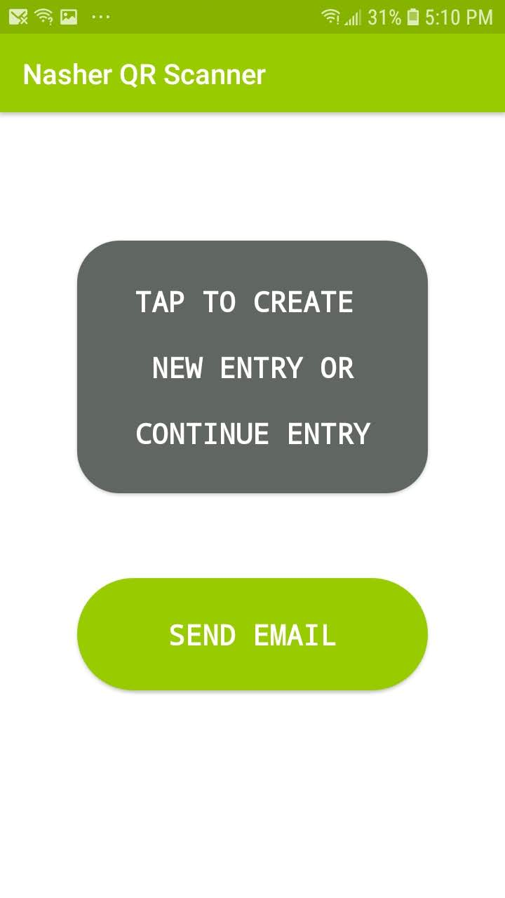
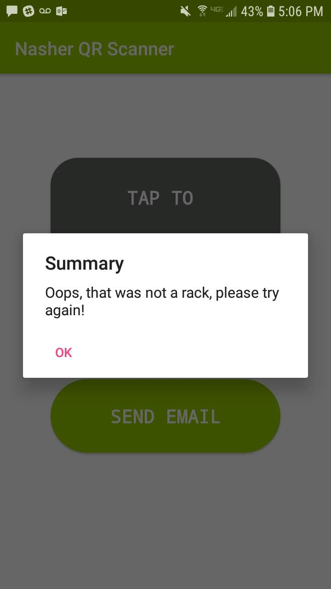
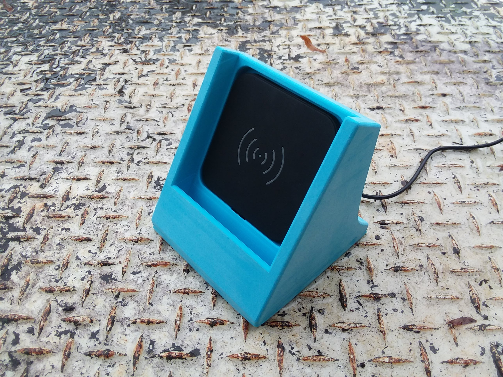
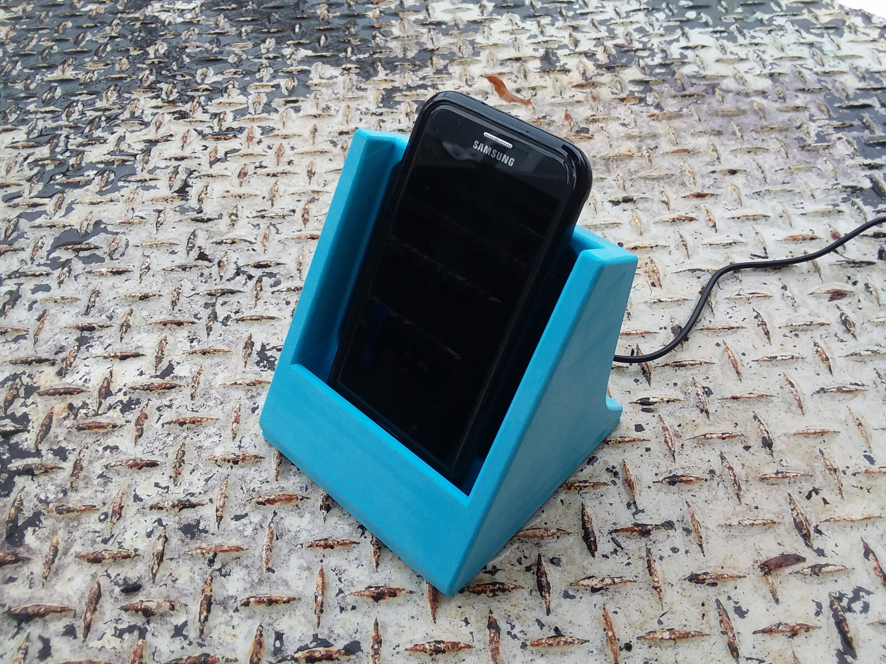

# deframentation
Deframentation is an app built specifically for the Nasher Museum of Art at Duke University.  The app is able to scan QR codes located on paintings and storage racks in order to accurately communicate painting locations with the necessary recipients.

## application

Homepage of the app

Features include:

- intuitive and simple user interface
- fast QR code scanning
- alerts to ensure user scans items in correct order
- ability to send email log to designated recipients

Instructions for Use:

1. Press button titled "tap to create new entry or continue entry"
2. Hover over desired **rack** (important to scan rack first, scanning painting first is not allowed and the app will prompt you to scan a rack) QR code with camera
3. Hover over desired **painting** QR code
4. When prompted, confirm whether painting and rack scanned are accurate.  If not, user will need to redo scanning.  If accurate, user has option to continue scanning or send email
5. Send email button will open the default email application and prepopulate the recipient field.  It attaches a log file of all paintings and racks scanned since the last log send.

An example alert that appears when a painting is scanned before a rack

## phone dock

stl files are included for wireless charging phone dock designed for use with [CHOETECH Wireless Charger](https://www.amazon.com/CHOETECH-Certified-Ultra-Slim-Compatible-Qi-Enabled/dp/B00C40OG22/) and [Samsung Galaxy J3 Eclipse](https://www.samsung.com/us/mobile/phones/all-other-phones/galaxy-j3-16gb-2017--unlocked--sm-j327uzkaxaa/)

dock with wireless charger in place

Phone in place in dock

`phoneholder.stl` is the first revision, `phoneholder2.stl` has been revised to have a larger cable routing channel and a lip to ensure phone doesn't slide out accidentally.
